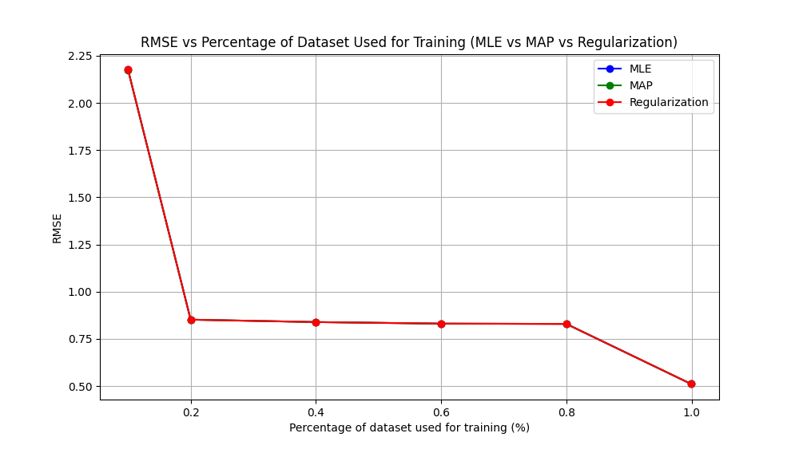
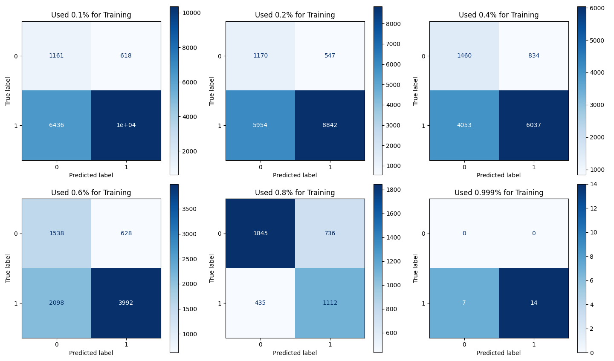
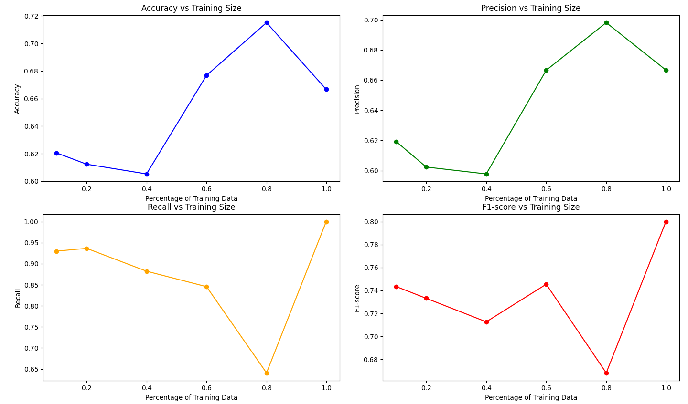

# Happy Ta

This file is for all the parts that does not need code

## Question 1

### Question A

Abstract superclasses in object-oriented programming facilitate modularity by defining common functionality that can be shared across multiple subclasses. This allows developers to easily swap or extend implementations without changing the rest of the system. It ensures that subclasses follow a consistent interface, promoting flexibility and reusability. In non-object-oriented languages, modular components require thorough documentation to describe how each function and data structure interacts, detailing inputs, outputs, and dependencies to help users understand how to integrate them effectively.

---

### Question B

``` python
import numpy as np


class q1BClass:
    def __init__(self, parameters: np.ndarray, hyperparameters: dict):
        """__init__ function for this class.

        keywords:
        parameters     -- A numpy matrix that contain all Parameters.
        hyperparameter -- A dict object that contain all Hyperparameters.
        hasParameters  -- A boolean value that indicate if the model
                            has parameters or not
        """
        self.parameters = parameters
        self.hyperparameters = hyperparameters

        if self.parameters:
            self.hasParameters = True
        else:
            self.hasParameters = False

    def train(self):
        """Start the training process"""
        pass

    def predict(self, test_or_learn=0):
        """Peform prediction

        keywords:
        test_or_learn -- determine if this function would test or learn.
                      ---- default: 0 (test)
        """
        pass

    def get_param(self, param):
        """Return a single or list of parameters bases on param.

        keywords:
        param -- determine what to return:
              ---- A single value => return 1 element of the parameters list
              ---- Tuple (start, end) => Return values from start-th elements
                    to end-th elements.
        """
        if isinstance(param, int):
            return self.parameters[param]
        elif isinstance(param, tuple) and len(param) == 2:
            start, end = param
            return self.parameters[start:end]
        else:
            raise TypeError("Param must be an int or a tuple of two elements.")

    def get_hyperparam(self, param):
        """Return a single or dict of hyperparameters bases on param.

        keywords:
        param -- determine what to return:
              ---- A key of str/int/other hashable type => return value
                   associated with the key
              ---- Tuple (start, end) => Return the values for a range of keys
        """

        if isinstance(param, (int, str)):
            return self.hyperparameters.get(param, "key not found")
        elif isinstance(param, tuple) and len(param) == 2:
            start, end = param
            keys = list(self.hyperparameters.keys())
            if start in keys and end in keys:
                start_idx = keys.index(start)
                end_ids = keys.index(end) + 1
                return {k: self.hyperparameters[k] for k in keys[start_idx:end_ids]}
            else:
                return "One or both keys not found"
        else:
            raise ValueError("Param must be an a key or a tuple of two keys.")
```

If we do not provide functions that manipulate each of the variables (set
methods), then how do you think these variables receive their assignments?

- In this case, the parameters is probably set at the start when the "thing" is being created and would remain unchange until the "thing" is not needed anymore

For a machine learning algorithm template, why should we prefer this
approach over function that manipulate each variable?

- For a ML algorithm template, having the parameters set only at the start, we insure consistency and resusaility

---

### Question C

- **For parameters: Array/Matrix**
  - Since we will most likely perform mathematical operations on these parameters (e.g., dot product, matrix multiplication), using an array/matrix would be more efficient and less of a hassle to set up.
  - Furthermore, using libraries like NumPy or SciPy, arrays/matrices are more optimized, making operations on parameters faster and more efficient compared to using a dictionary.

- **For hyperparameters: Hash map/Dictionary**
  - Since each algorithm has different hyperparameters and types, using a dictionary helps accommodate different hyperparameters without needing to maintain a fixed structure.
  - A dictionary also allows for easy modification, making it convenient to adjust settings during experimentation.
  - Furthermore, since hyperparameters are usually referred to by name, using a dictionary allows you to associate each hyperparameter with a meaningful key.

---

## Question 3

### Question A

#### III



#### IV

Interpretation of $\theta_n$:

- Positive $\theta_n$: This indicates that an increase in the n-th feature $x_n$ leads to an increase in the predicted real estate value.

- Negative $\theta_n$: A negative coefficient implies that an increase in the n-th feature results in a decrease in the predicted value.

- Zero $\theta_n$: This means that the n-th feature has no impact on the predicted value. It does not influence the real estate value in the model, suggesting that it might not be a significant predictor for this particular dataset.

### Question B

#### I

Using **Regularization** as my "flavor" for linear regression, I got:

- Number of 1's: 12197
- Number of 0's: 8443

With 1's accounting for 59.09% and 0's for 50.91%, this seems reasonable to me. In Section III of this question, I observed that when regularization was performed using nearly all the data (99%), the RMSE was around 50%. Given this, I wasn’t too surprised to see values close to 50% here.

#### II

Since we are trying to predict the **ground truth**, using it will introduce data leakage during training that would not appear in real-world problem.

#### III



#### IV



Looking at the graph, I seems that 80% provide the best sets of data for accuracy and precision. Having said that, when using 80% of the dataset, the recall rate and F1-score has a dramatic decrease. But then if we use 99% of the data then we lose all precision and accuracy but the recall rate and F1-score sky rocket. This could indicate a problem with either the dataset or my implementation of Logistic Regression.

#### V

The y-intercept defines the baseline shift of the logistic curve, setting the probability when all features are zero. Positive or negative coefficients for features then push the probability up or down from that baseline, affecting the position of the curve relative to the threshold (0.5) where the decision flips from 'not purchasing' to 'purchasing'
